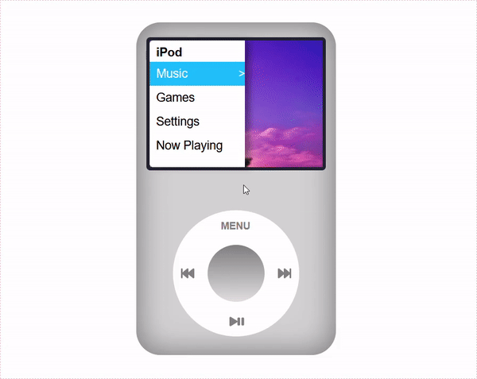
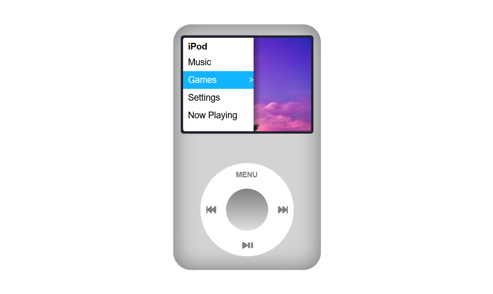
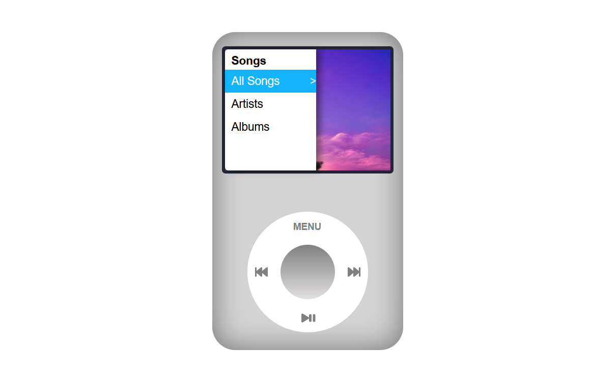
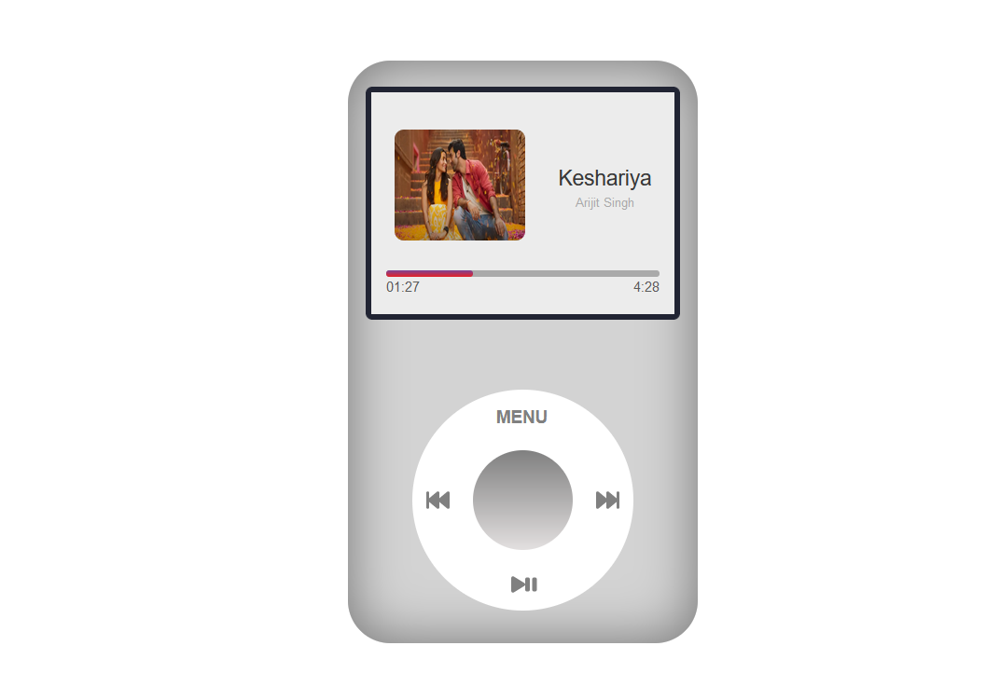
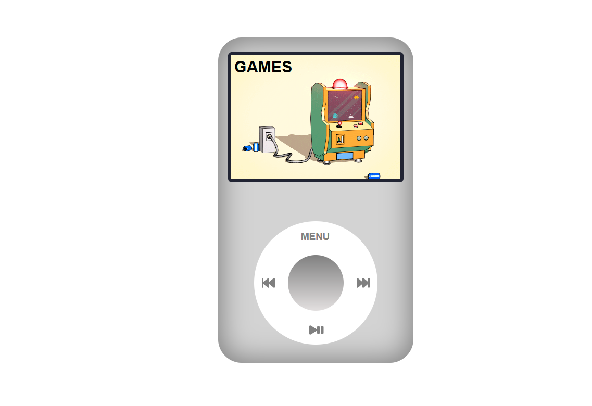

      <h1>  iPod UI - using React</h1>
     

# Description
the retro iPod UI - using React

# Features
Now the UI part is made and Games and Settings part are left with dummy data. But there are pre-loaded songs (as of now 2).

Features:
- Can listen to song on the music player UI section
- Slide drag on the wheel to move on the menu sections
- Play/Pause song through the wheel.
- Skip to next/previous section by tapping on the skip buttons
- Hold the forward/backward button to seek the music +10/-10 seconds
- Menu button to go to the mainMenu/back. 

# In action
  

# Screenshots
  
  
  
 

# Tech Used
     
      
### How to Setup:
- Step 1: npm install to install all the dependencies
- Step 2: npm start to start the server    